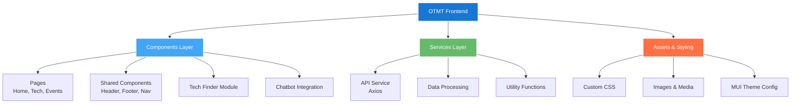
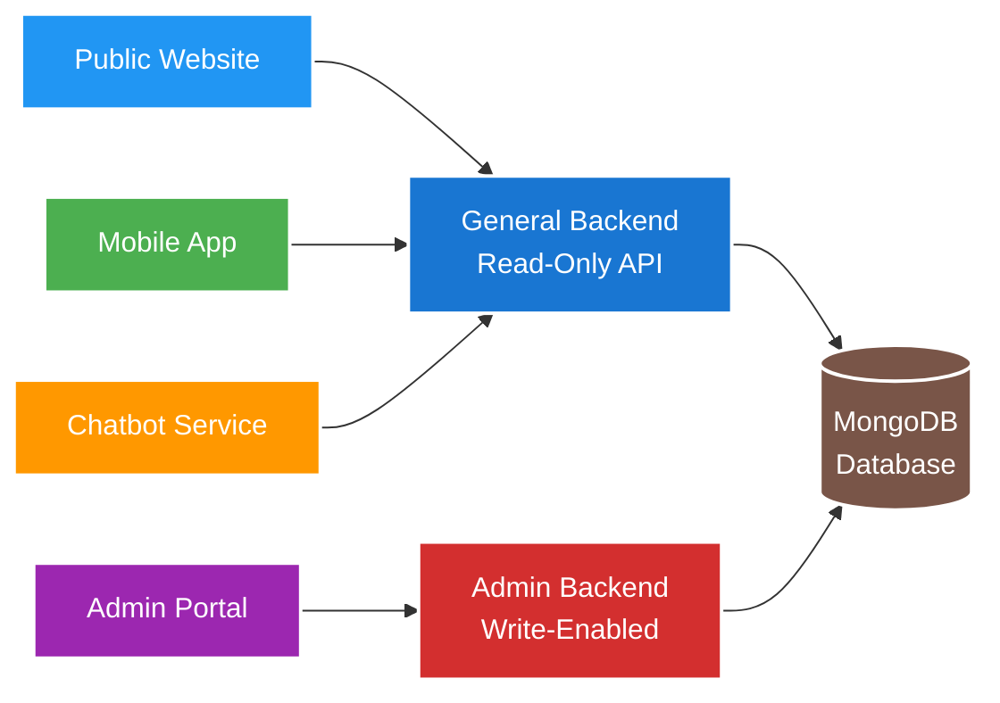

# OTMT Platform - Main Website Frontend

<div align="center">
  <h3>🚀 Office of Technology Management and Transfer</h3>
  <p><em>A modern digital platform for showcasing innovations and research projects</em></p>
  
  []()
  []()
  []()
</div>

---

## 📋 Table of Contents

- [Overview](#-overview)
- [Features](#-features)
- [Tech Stack](#-tech-stack)
- [Architecture](#-architecture)
- [Installation](#-installation)
- [Environment Setup](#-environment-setup)
- [Usage](#-usage)
- [Project Structure](#-project-structure)
- [API Integration](#-api-integration)
- [Contributing](#-contributing)
- [Related Repositories](#-related-repositories)
- [Documentation](#-documentation)

## 🌟 Overview

The OTMT Main Website serves as the primary public-facing interface for the Office of Technology Management and Transfer platform. It showcases institutional technologies, research projects, and innovations in a modern, accessible, and user-friendly interface.

### Key Highlights
- **Modern UI/UX**: Complete redesign with professional white-based theme
- **Tech Finder Integration**: Seamless database integration for technology showcase
- **Responsive Design**: Optimized for all devices and screen sizes
- **Accessibility First**: Built with modern accessibility standards
- **Performance Optimized**: Minified production builds for fast load times

## ✨ Features

### 🏠 Core Pages
- **Homepage**: Hero section with featured technologies and spotlights
- **Technologies**: Comprehensive Tech Finder with search and filter capabilities
- **Our Research**: Detailed research showcase and publications
- **Our Partners**: Redesigned partner showcase with interactive elements
- **Events**: Dynamic events listing with registration links
- **About**: Comprehensive information about OTMT

### 🔍 Tech Finder Module
- Advanced search and filtering system
- Detailed technology profiles with:
  - Technical specifications
  - Applications and use cases
  - Innovation team details
  - Patent status tracking
  - Related documents and brochures
  - QR code integration for mobile access

### 💬 AI Chatbot Integration
- On-demand help popup window
- Technology information queries
- TRL (Technology Readiness Level) assessments
- General assistance and guidance

### 🎨 User Experience
- Fluid animations and interactions
- Intuitive navigation structure
- Professional visual design
- Mobile-responsive layout
- Fast loading times

## 🛠 Tech Stack

- **Frontend Framework**: React.js
- **UI Library**: Material-UI (MUI) with custom CSS
- **Build Tool**: Vite/Create React App
- **Styling**: Custom CSS with Material-UI components
- **State Management**: React Hooks (useState, useEffect)
- **HTTP Client**: Axios for API calls
- **Deployment**: Production build served via NGINX

## 🏗 Architecture

### Frontend Architecture



**Alternative Text-Based Structure:**
```
OTMT Frontend
├── 📱 Components/
│   ├── Pages (Home, Technologies, Events, Research)
│   ├── Shared (Header, Footer, Navigation)
│   ├── Tech Finder Module
│   └── Chatbot Integration
├── 🔧 Services/
│   ├── API Service (Axios)
│   ├── Data Processing
│   └── Utility Functions
└── 🎨 Assets & Styling/
    ├── Custom CSS
    ├── Images & Media
    └── MUI Theme Configuration
```

### Data Flow



**Data Flow Process:**
1. **API Consumption**: Fetches data from General Backend (Read-only)
2. **State Management**: React hooks for component state
3. **Routing**: Client-side routing for SPA experience
4. **Chatbot**: Real-time communication with FastAPI chatbot service

## 🚀 Installation

### Prerequisites
- Node.js (v14 or higher)
- npm or yarn package manager
- Git

### Quick Start

```bash
# Clone the repository
git clone https://github.com/devan1shX/TMTO.git
cd TMTO

# Install dependencies
npm install --force

# Start development server
npm run start
```

The application will be available at `http://localhost:3000`

## ⚙️ Environment Setup

### Development Configuration

1. **API Endpoints**: Update the API base URLs in your configuration files:
```javascript
// config/api.js
const API_BASE_URL = process.env.NODE_ENV === 'production' 
  ? 'https://api.otmt.iiitd.ac.in' 
  : 'http://localhost:5000';
```

2. **Environment Variables**: Create a `.env` file:
```env
REACT_APP_API_URL=http://localhost:5000
REACT_APP_CHATBOT_URL=http://localhost:8000
REACT_APP_ENVIRONMENT=development
```

### Production Deployment

1. **Build the application**:
```bash
npm run build
```

2. **Serve static files**: The build folder contains production-ready files that can be served by any static file server (NGINX, Apache, etc.)

## 🎯 Usage

### Running in Development Mode
```bash
npm run start
```

### Building for Production
```bash
npm run build
```

### Testing
```bash
npm run test
```

### Code Linting
```bash
npm run lint
```

## 📁 Project Structure

```
TMTO/
├── public/                 # Static assets
│   ├── index.html
│   └── favicon.ico
├── src/
│   ├── components/         # Reusable components
│   │   ├── common/        # Shared components
│   │   ├── techfinder/    # Tech Finder module
│   │   └── chatbot/       # Chatbot integration
│   ├── pages/             # Page components
│   │   ├── Home.js
│   │   ├── Technologies.js
│   │   ├── Research.js
│   │   └── Events.js
│   ├── services/          # API services
│   │   ├── api.js
│   │   └── techService.js
│   ├── styles/            # CSS files
│   │   ├── global.css
│   │   └── components.css
│   ├── utils/             # Utility functions
│   ├── App.js             # Main app component
│   └── index.js           # Entry point
├── package.json           # Dependencies and scripts
└── README.md             # This file
```

## 🔌 API Integration

The frontend integrates with multiple backend services:

### General Backend API
- **Base URL**: `https://api.otmt.iiitd.ac.in` (Production)
- **Purpose**: Read-only access to technologies and events data
- **Endpoints**:
  - `GET /api/technologies` - Fetch all technologies
  - `GET /api/technologies/:id` - Fetch specific technology
  - `GET /api/events` - Fetch all events

### Chatbot API
- **Base URL**: FastAPI service endpoint
- **Purpose**: AI-powered assistance and TRL assessments
- **Integration**: Real-time chat functionality

### Example API Usage
```javascript
import axios from 'axios';

const apiService = {
  getTechnologies: async () => {
    const response = await axios.get('/api/technologies');
    return response.data;
  },
  
  getTechnologyById: async (id) => {
    const response = await axios.get(`/api/technologies/${id}`);
    return response.data;
  }
};
```

## 🤝 Contributing

### Development Workflow
1. Fork the repository
2. Create a feature branch: `git checkout -b feature/new-feature`
3. Make your changes
4. Test thoroughly
5. Commit: `git commit -m "Add new feature"`
6. Push: `git push origin feature/new-feature`
7. Create a Pull Request

### Code Style
- Follow React best practices
- Use Material-UI components where possible
- Maintain consistent naming conventions
- Add comments for complex logic
- Ensure responsive design

## 🔗 Related Repositories

This frontend is part of a larger ecosystem. Related repositories:

- **[Admin Frontend](https://github.com/devan1shX/Admin-Frontend)** - User/Admin portal for content management
- **[General Backend](https://github.com/devan1shX/TMTO-Backend)** - Read-only API service
- **[Admin Backend](https://github.com/devan1shX/Admin-Backend)** - Write-enabled API for admin operations
- **[Mobile App](https://github.com/devan1shX/OTMT-App)** - Native Android application
- **[Chatbot Service](https://github.com/Beingstupid4me/Tech-Transfer-Pal)** - AI-powered assistance
- **[Brochure Generator](https://github.com/devan1shX/Brochure-Automation)** - PDF brochure creation tool

## 📚 Documentation

### Full Project Documentation
- **[Complete Technical Report](./docs/OTMT_final_Report.pdf)** - Comprehensive project documentation
- **[Architecture Overview](./docs/architecture.md)** - System design and workflows
- **[Deployment Guide](./docs/deployment.md)** - Production deployment instructions

### API Documentation
- Refer to backend repositories for detailed API documentation
- Postman collection available for testing endpoints

## 📄 License

This project is developed for the Office of Technology Management and Transfer, IIIT Delhi.

## 👥 Team

**Developers:**
- **Amartya Singh** - amartya22062@iiitd.ac.in
- **Anish** - anish22075@iiitd.ac.in

**Supervisor:**
- **Mr. Alok Nikhil Jha** - Office of Technology Management and Transfer

---

<div align="center">
  <p>Made with ❤️ for IIIT Delhi's innovation ecosystem</p>
</div>
